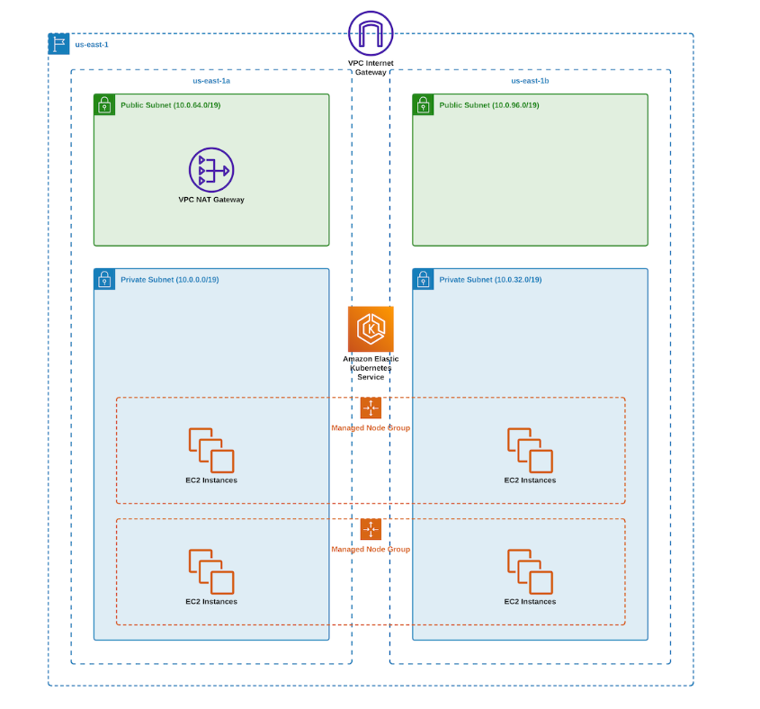

# eks-infrastructure-with-terraform

Project development stages:
•	Create terraform scripts to deploy AWS EKS Cluster:

1-	Create AWS VPC using Terraform

2-   Create EKS using terraform

3-	Add IAM User & Role to EKS by creating an IAM role with full access to Kubernetes API and let users to assume that role if they need access to EKS.

4-	Deploy Cluster Autoscaler to automatically scale the EKS cluster.

Notes:
To create AWS VPC, we use terraform-aws-module . Let's call it vpc.tf and provide a CIDR range. For EKS, you need at least two availability zones. Let's use us-east-1a and 1b. then deploy our Kubernetes workers in the private subnets with a default route to NAT Gateway. However, if you're going to expose your application to the internet, you would need public subnets with a default route to the Internet Gateway.
To run the workload on your Kubernetes cluster, you need to provision instance groups. (Options: eks-managed nodes/ self-managed groups/Fargate). I used in this project managed node groups which automate the provisioning and lifecycle management of nodes (Amazon EC2 instances) for EKS.
Amazon eks tags managed node group resources so that they are configured to use the k8s cluster Autoscaler.
The Kubernetes cluster Autoscaler automatically adjusts the number of nodes in your cluster when pods fail or are rescheduled onto other nodes.
When creating a managed node you can choose either the on-demand or spot capacity type. 
When you create an Amazon EKS cluster , the IAM principal that creates the cluster is automatically granted system: master permissions  in the cluster’s role based access control (rbac) configuration in the Amazon EKS control plane
To grant additional IAM principals the ability to interact with your cluster , edit the AWS-auth configMap with Kubernetes , and create a Kubernetes rolebinding or clusterrolebinding with the name of a group that you specify in the aws-auth configMap.
-	Add IAM user to EKS cluster: add IAM user directly to the EKS configMap. whenever you need to grant access to user. you need to update auth-configmap.
Or by:
-	 Add IAM role to EKS cluster: grant access to IAM role just once by using aws configMap and then you can simply allow users outside of EKS to assume that role. 

Technologies used in this project:
-	Cloud provider: AWS
-	Infrastructure as a code: Terraform
-	System for managing containerized applications: Amazon EKS Elastic Kubernetes service
